# 42CPP

This comprehensive C++ learning project is structured around various modules, each designed to delve deep into specific aspects of C++ programming. By breaking down the curriculum into smaller projects, learners are provided with hands-on experience and practical understanding of core C++ concepts.

## Tehnologies

    

## Agenda

0. `CPP00`
	- `ex00` basic of C++. Program that take a string and display it in uppercase.
	- `ex01` basic of Object Oriented Programming. Program that allow us to add a basic date of Users to 'PhoneBook'.
1. `CPP01`
	- `ex00` show the diffrence in creating object on a stack and on heap.
	- `ex01` creating a table of objects.
	- `ex02` show the diffrence between pointer and reference.
	- `ex03` show that pointer can be null but pointer always have to be set.
	- `ex04` file operations. Own 'sed' program.
	- `ex05` list of pointers to functions. Harl will infinitly complain about everything.
2. `CPP02`
	- `ex00` basic class with prints used for next exercises.
	- `ex01` add conversion function to class Fixed.
	- `ex02` override operators.
3. `CPP03`
	- `ex00` two objects that represent fightin robots used for next exercises.
	- `ex01` class ScavTrap that inherits class ClapTrap and has ability to deal dmg.
	- `ex02` class FragTrap that inherits class ScavTrap and has ability to deal dmg and give high fives.
4. `CPP04`
	- `ex00` explain virtual functions and abstract.clesses.
	- `ex01` explain virtual destructors.
	- `ex02` class interfaces.
5. `CPP05` (compiling on mac)
	- `ex00` create own exceptions. Creating Bureaucrat class.
	- `ex01` class working with diffrent class. Cless Bureaucrat use Form class.
	- `ex02` changing class Form to be an abstract class and add more specyfic types of Forms.
	- `ex03` add class Intern to create Forms.
7. `CPP07`
	- `ex00` templates functions. (swap)
	- `ex01` templates functions. (iteration)
	- `ex02` templates class. (array)
8. `CPP08`
	- `ex00` templates functions and algorithm library.
	- `ex01` vector and iterators.
	- `ex02` creating a class that acts like a stack but have functions begin() and end()
9. `CPP09`
	In this exercise ther was restriction to use type od data container that is unique for module.
	- `ex00` Map. Calculate bitcoin wallet value.
	- `ex01` Stack. Create calculator for Reverse Polish Notation.
	- `ex02` Deque and Vector. Sort containers using MergeInsertSort.

## Modules

	<h3>CPP00</h3>
	<h4>ex00</h4>
	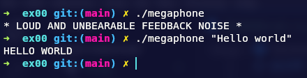
	<h4>ex01</h4>
	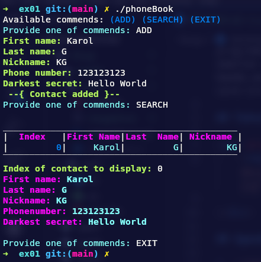
	

	<h3>CPP01</h3>
	<h4>ex00</h4>
	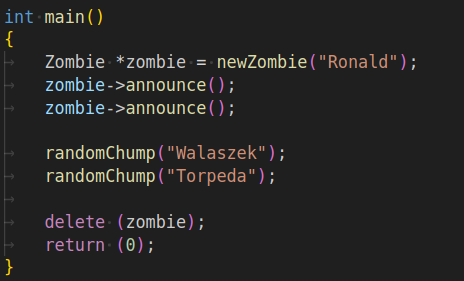
	<h4>ex01</h4>
	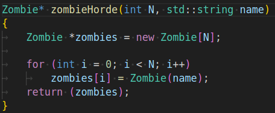
	<h4>ex02</h4>
	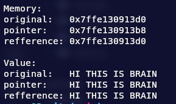
	<h4>ex03</h4>
	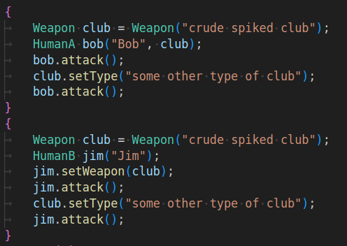
	<h4>ex04</h4>
	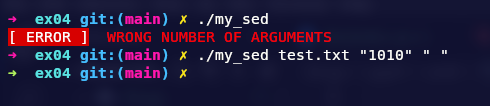
	<h4>ex05</h4>
	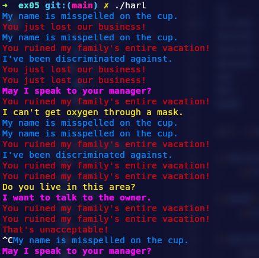
	

	<h3>CPP02</h3>
	<h4>ex00</h4>
	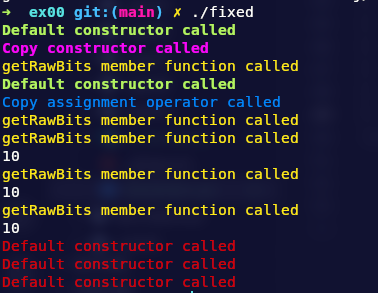
	<h4>ex01</h4>
	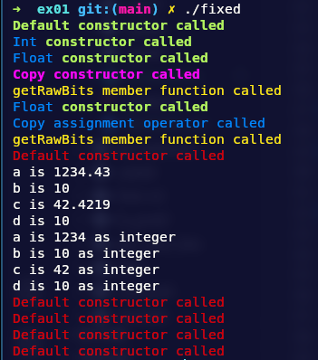
	<h4>ex02</h4>
	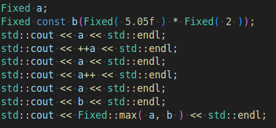
	

	<h3>CPP03</h3>
	<h4>ex00</h4>
	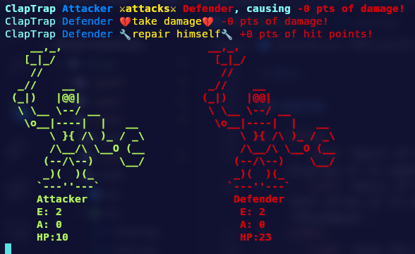
	<h4>ex01</h4>
	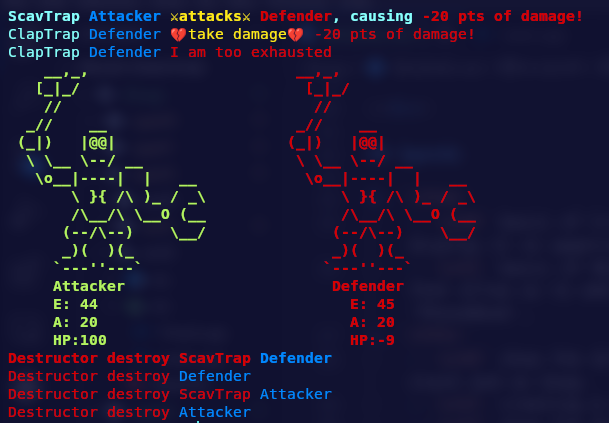
	<h4>ex02</h4>
	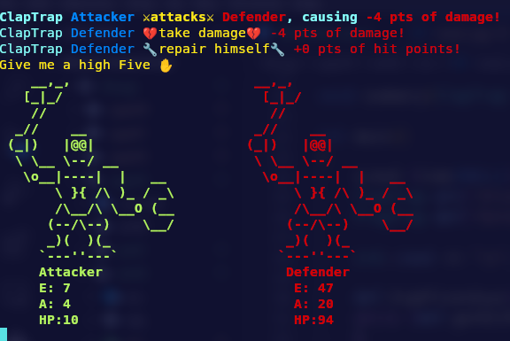
	<h3>CPP04</h3>
	<h4>ex00</h4>
	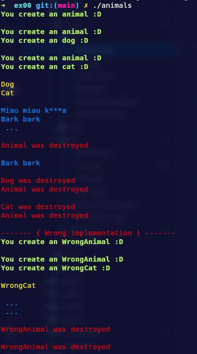
	<h4>ex01</h4>
	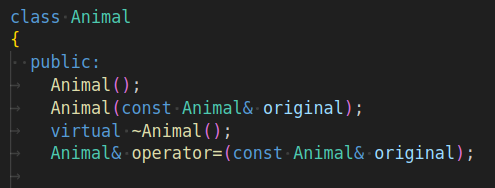
	<h4>ex02</h4>
	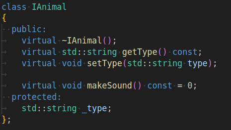
	

	<h3>CPP05</h3>
	<h4>ex00</h4>
	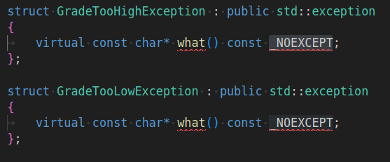
	<h4>ex01</h4>
	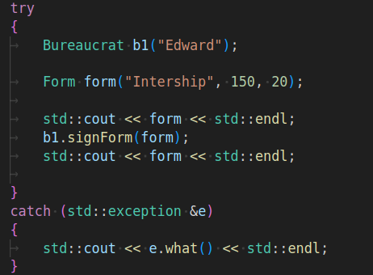
	<h4>ex02</h4>
	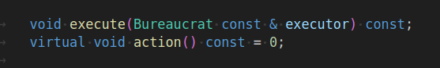
	<h4>ex03</h4>
	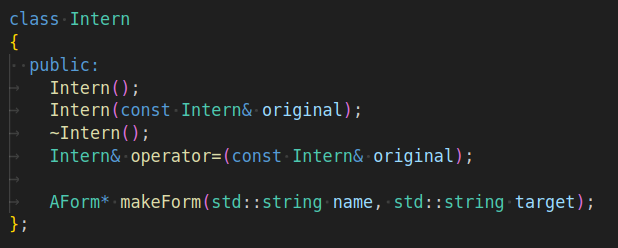
	

	<h3>CPP07</h3>
	<h4>ex00</h4>
	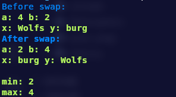
	<h4>ex01</h4>
	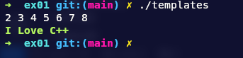
	<h4>ex02</h4>
	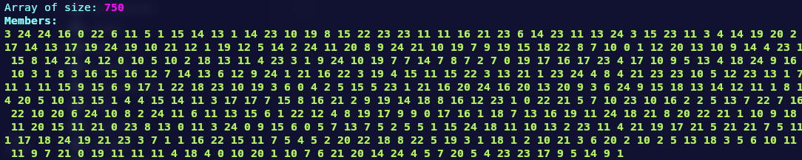
	

	<h3>CPP08</h3>
	<h4>ex00</h4>
	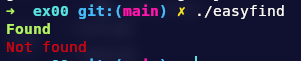
	<h4>ex01</h4>
	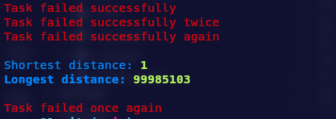
	<h4>ex02</h4>
	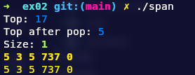
	

	<h3>CPP09</h3>
	<h4>ex00</h4>
	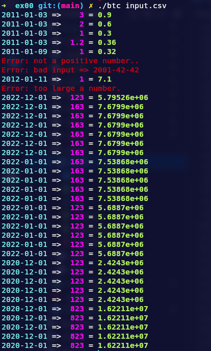
	<h4>ex01</h4>
	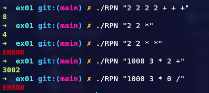
	<h4>ex02</h4>
	

